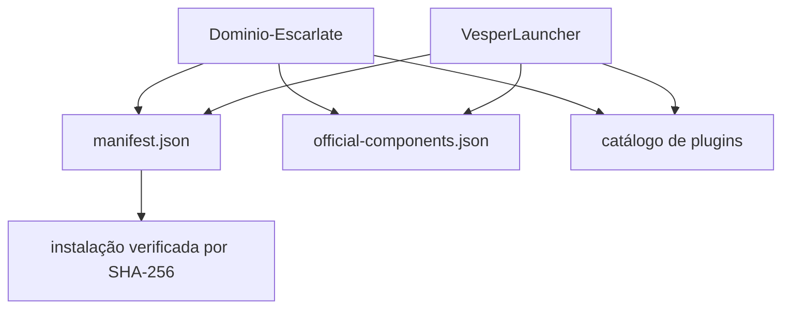

# Arquitetura de distribuição

## Manifesto principal

`manifest.json` contém versão do pacote e uma lista de caminhos, URLs relativas e hashes. O Launcher usa esses dados para verificar e atualizar os ficheiros geridos.

## Componentes oficiais

`official-components.json` descreve componentes Vesper, versão, destino, publicação, obrigatoriedade, URL e hash.

## Catálogo

O catálogo público alimenta a biblioteca de plugins do Launcher. Metadados de compatibilidade devem ser tratados separadamente de execução/instalação.

## Fronteiras

Este repositório não deve conter a fonte do VesperCore, PlayerServices, VesperClient ou VesperLauncher. Artefactos binários aprovados podem ser distribuídos quando licença, origem e integridade forem verificadas.
